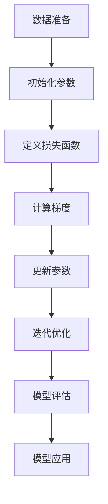
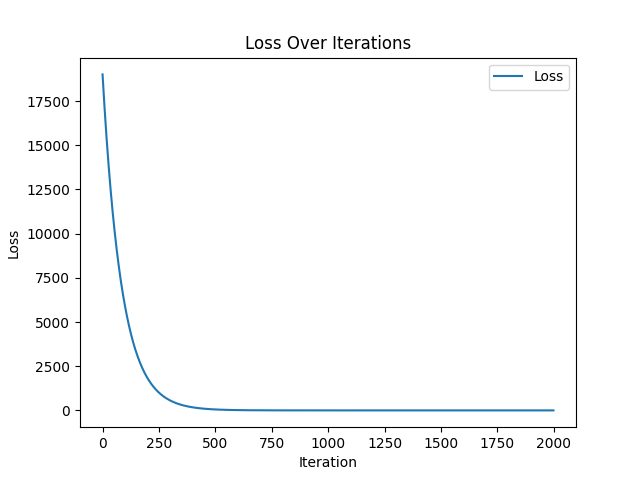

# 线性回归基础理论

线性回归是一种统计方法，用于研究因变量（目标变量）与一个或多个自变量（特征变量）之间的线性关系。其目标是找到一个线性函数，使得预测值与实际值之间的误差最小。

## 1. 线性回归模型

线性回归模型的数学表达式为：

$$
y = w_1x_1 + w_2x_2 + \dots + w_nx_n + b
$$

其中：
- $y$：预测值（因变量）
- $x_1, x_2, \dots, x_n$：自变量（特征）
- $w_1, w_2, \dots, w_n$：回归系数（权重）
- $b$：偏置项（截距）

对于简单线性回归（单一特征），公式简化为：

$$
y = wx + b
$$

## 2. 损失函数

线性回归通常使用均方误差（MSE）作为损失函数，用于衡量模型预测值与实际值之间的差异：

$$
\text{MSE} = \frac{1}{m} \sum_{i=1}^m (y_i - \hat{y}_i)^2
$$

其中：
- $m$：样本数量
- $y_i$：实际值
- $\hat{y}_i$：预测值

## 3. 参数优化

通过最小化损失函数来优化模型参数（权重和偏置）。常用的方法是梯度下降算法，其更新规则为：

$$
w_j := w_j - \alpha \frac{\partial \text{MSE}}{\partial w_j}
$$
$$
b := b - \alpha \frac{\partial \text{MSE}}{\partial b}
$$

其中：
- $\alpha$：学习率，控制更新步长

## 4. 假设与限制

线性回归模型的基本假设包括：
1. **线性关系**：因变量与自变量之间是线性关系。
2. **独立性**：样本数据相互独立。
3. **同方差性**：误差项的方差相同。
4. **正态性**：误差项服从正态分布。

## 5. 应用场景

线性回归广泛应用于以下场景：
- 房价预测
- 销售额预测
- 医疗数据分析

## 6. 优缺点

### 优点
- 简单易懂，计算效率高
- 适合线性关系的数据

### 缺点
- 对异常值敏感
- 无法处理非线性关系

## 7. 使用梯度下降法的线性回归流程

以下是使用梯度下降法进行线性回归的一般流程：

1. **数据准备**
  - 收集并清洗数据，确保数据质量。
  - 将数据分为训练集和测试集。
  - 对特征进行标准化或归一化（如果特征值范围差异较大）。

2. **初始化参数**
  - 随机初始化权重 $w$ 和偏置 $b$。
  - 设置学习率 $\alpha$ 和迭代次数。

3. **定义损失函数**
  - 使用均方误差（MSE）作为损失函数：
    $$
    \text{MSE} = \frac{1}{m} \sum_{i=1}^m (y_i - \hat{y}_i)^2
    $$

4. **计算梯度**
  - 对损失函数分别求 $w$ 和 $b$ 的偏导数：
    $$
    \frac{\partial \text{MSE}}{\partial w_j} = -\frac{2}{m} \sum_{i=1}^m x_{ij} (y_i - \hat{y}_i)
    $$
    $$
    \frac{\partial \text{MSE}}{\partial b} = -\frac{2}{m} \sum_{i=1}^m (y_i - \hat{y}_i)
    $$

5. **更新参数**
  - 根据梯度下降公式更新参数：
    $$
    w_j := w_j - \alpha \frac{\partial \text{MSE}}{\partial w_j}
    $$
    $$
    b := b - \alpha \frac{\partial \text{MSE}}{\partial b}
    $$

6. **迭代优化**
  - 重复计算梯度并更新参数，直到达到设定的迭代次数或损失函数收敛。

7. **模型评估**
  - 使用测试集评估模型性能，计算均方误差或其他指标。
  - 可视化预测值与实际值的对比。

8. **模型应用**
  - 使用训练好的模型对新数据进行预测。



通过上述流程，可以有效地训练线性回归模型并应用于实际问题。

## 运行结果

```python
# Parameters for the linear function y = mx + b
m = 2.5  # slope
b = 4.0  # intercept
num_samples = 200
```

```text
Starting gradient descent at b = 0, w = 0, error = 19231.940926137744
Running ...
After 2000 iterations b = 0.04440638869435283, w = 2.5613373281771312, error = 4.621387219322447
Answer is : w = 2.5, b = 4.0
```



## 线性回归优缺点分析

### 优点分析
1. **简单易懂**：线性回归模型具有简单的数学形式，易于理解和实现。
2. **计算效率高**：由于其线性性质，计算复杂度较低，适合处理大规模数据。
3. **解释性强**：模型的回归系数可以直接解释特征对目标变量的影响。
4. **适合线性关系**：在数据满足线性假设时，模型表现良好。

### 缺点分析
1. **对异常值敏感**：线性回归对数据中的异常值非常敏感，可能导致模型偏差较大。
2. **假设严格**：模型依赖于线性关系、同方差性和正态性等假设，实际数据可能不完全满足这些条件。
3. **无法处理非线性关系**：当特征与目标变量之间存在非线性关系时，线性回归的表现较差。
4. **特征独立性要求**：当特征之间存在多重共线性时，模型的稳定性和预测能力会受到影响。
5. **欠拟合风险**：对于复杂数据集，线性回归可能无法捕捉数据的复杂模式，导致欠拟合。

通过结合优缺点分析，可以更好地判断线性回归是否适合特定问题，并在必要时选择其他更复杂的模型。
