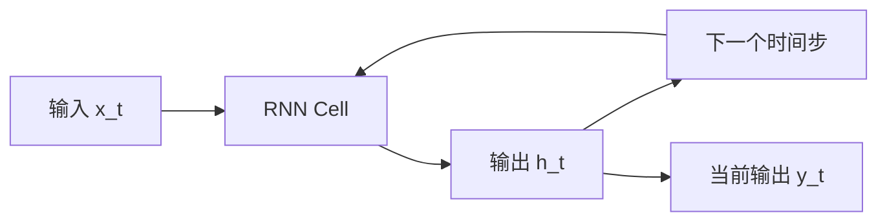
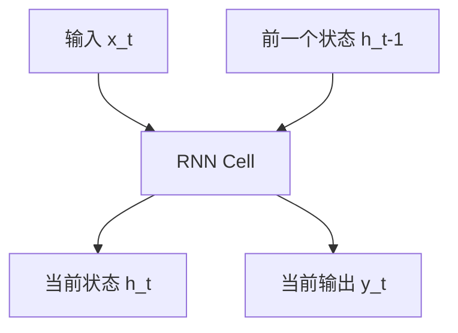
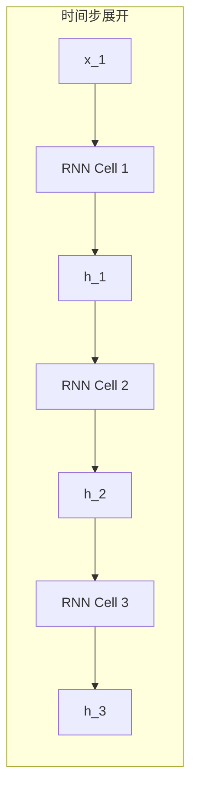

# RNN (循环神经网络) 流程图

## 1. RNN 基本结构

## 2. RNN 状态更新流程

### 2.1 单个时间步的状态更新

### 2.2 数学表达式

- 状态更新公式：
  $$
  h_t = tanh(W_{hh}h_{t-1} + W_{xh}x_t + b_h)
  $$
- 输出公式：
  $$
  y_t = W_{hy}h_t + b_y
  $$

## 3. RNN 展开示意图

## 4. 参数说明

- x_t: 时间步 t 的输入
- h_t: 时间步 t 的隐藏状态
- y_t: 时间步 t 的输出
- W_hh: 隐藏状态到隐藏状态的权重矩阵
- W_xh: 输入到隐藏状态的权重矩阵
- W_hy: 隐藏状态到输出的权重矩阵
- b_h: 隐藏状态的偏置
- b_y: 输出的偏置

## 5. 特点说明

1. 时间维度展开
   - RNN 可以处理任意长度的序列
   - 每个时间步共享相同的参数
   - 通过隐藏状态传递历史信息

2. 状态更新机制
   - 当前状态依赖于前一个状态和当前输入
   - 使用 tanh 激活函数保证状态值在合理范围内
   - 通过权重矩阵学习输入和状态之间的关系

3. 信息流动
   - 正向：从过去到未来
   - 反向：通过反向传播更新参数
   - 梯度可能随时间步长而消失或爆炸
